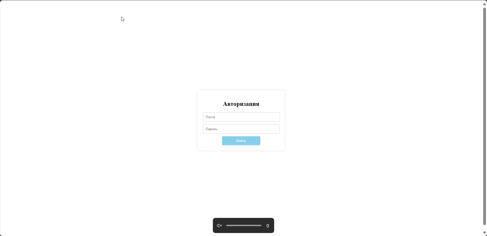
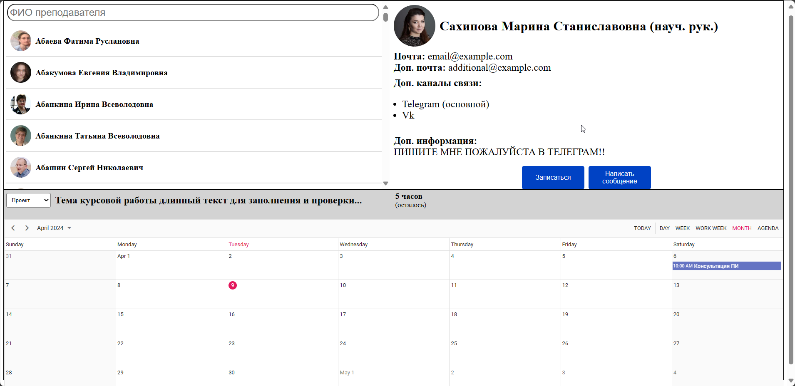
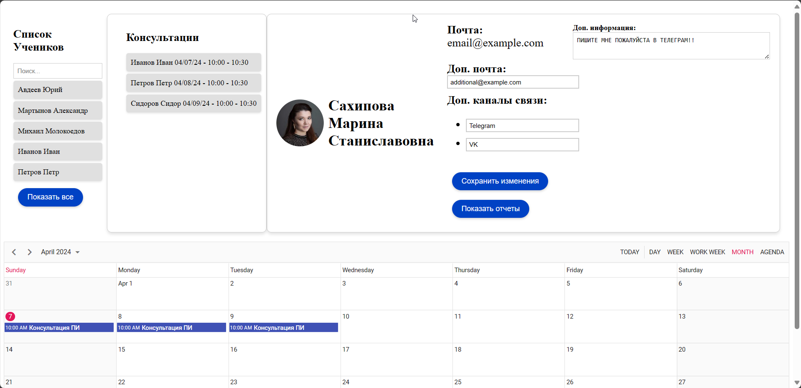
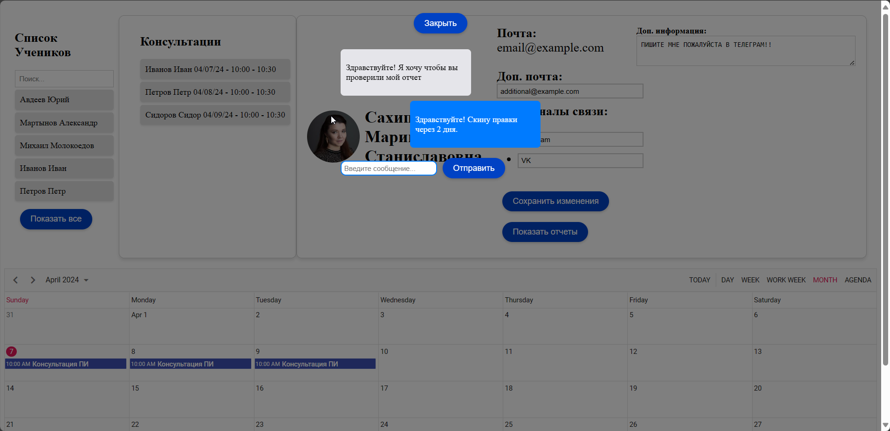

## Хакатон 2024 победитель
Разработан MVP в рамках хакатона НИУ ВШЕ "Онлайн запись на консультации и связь с преподавателем"

Студент выбирает преподавателя к которому можно записаться на консультацию

Преподаватель может создавать события и общаться со студентом



## Project Setup

```sh
npm install
```

### Compile and Hot-Reload for Development

```sh
npm run dev
```

### Compile and Minify for Production

```sh
npm run build
```

### Lint with [ESLint](https://eslint.org/)

```sh
npm run lint
```
